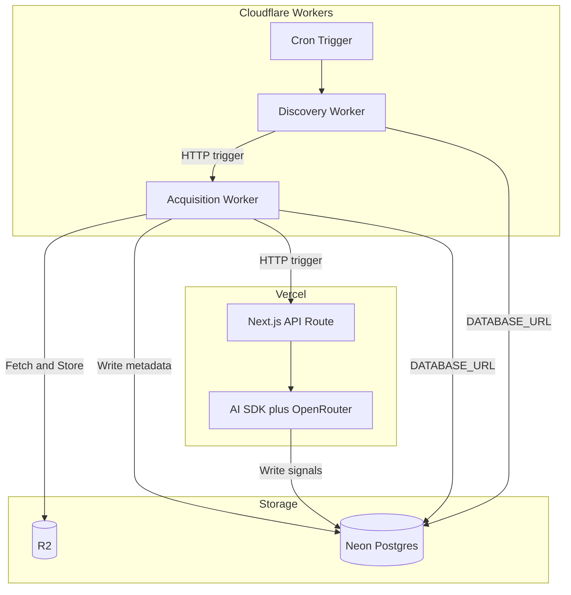

# AGI Canary Watcher - Feature Roadmap

This document outlines the implementation order for all features. Each feature builds upon previous ones, ensuring progressive development.

## Architecture: Hybrid Approach

- **App:** Next.js 16 on Vercel — UI, API routes, AI signal processing (AI SDK + OpenRouter)
- **Pipeline:** Cloudflare Workers — Discovery, Acquisition, orchestration. Workers use Neon serverless driver and R2



## Implementation Phases

### Phase 1: Foundation

Features that establish the core data structures, pipeline infrastructure, and configuration.

| Order | Feature                       | FRED                                | Dependencies |
| ----- | ----------------------------- | ----------------------------------- | ------------ |
| 1.0   | Pipeline Infrastructure       | `13-pipeline-infrastructure.md`     | None         |
| 1.1   | Database Schema & Core Models | `01-database-schema.md`             | None         |
| 1.2   | Source Registry & Management  | `02-source-registry.md`             | 1.1          |
| 1.3   | Cloudflare Infra Management   | `14-cloudflare-infra-management.md` | 1.0          |

### Phase 2: Data Pipeline

Features that power the data ingestion and processing system.

| Order | Feature                       | FRED                         | Dependencies  |
| ----- | ----------------------------- | ---------------------------- | ------------- |
| 2.1   | Discovery Pipeline            | `03-discovery-pipeline.md`   | 1.0, 1.1, 1.2 |
| 2.2   | Content Acquisition Pipeline  | `04-acquisition-pipeline.md` | 1.0, 2.1      |
| 2.3   | AI Signal Processing Pipeline | `05-signal-processing.md`    | 2.2           |

### Phase 3: Core UI

The main user-facing pages and visualizations.

| Order | Feature                  | FRED                       | Dependencies |
| ----- | ------------------------ | -------------------------- | ------------ |
| 3.1   | Home Page (Control Room) | `06-home-page.md`          | 1.1          |
| 3.2   | Capability Profile Page  | `07-capability-profile.md` | 3.1          |
| 3.3   | Autonomy & Risk Page     | `08-autonomy-risk.md`      | 3.1          |

### Phase 4: Extended UI

Additional pages for deeper exploration.

| Order | Feature              | FRED                    | Dependencies |
| ----- | -------------------- | ----------------------- | ------------ |
| 4.1   | Timeline Page        | `09-timeline-page.md`   | 3.1          |
| 4.2   | Signal Explorer Page | `10-signal-explorer.md` | 3.1          |

### Phase 5: Enhancement

Polish and extended functionality.

| Order | Feature                    | FRED                  | Dependencies |
| ----- | -------------------------- | --------------------- | ------------ |
| 5.1   | Daily Brief & News Section | `11-daily-brief.md`   | 2.3, 3.1     |
| 5.2   | Mobile Responsive Design   | `12-mobile-design.md` | 3.1-4.2      |

## Dependency Graph

```
Phase 1: Foundation
┌─────────────────────┐
│  1.0 Pipeline       │
│  Infrastructure     │
└─────────┬───────────┘
          │
┌─────────▼───────────┐     ┌─────────────────────┐
│  1.1 Database       │────▶│  1.2 Source         │
│  Schema             │     │  Registry           │
└─────────┬───────────┘     └─────────┬───────────┘
          │                           │
          └───────────┬───────────────┘
                      │
          ┌───────────▼───────────┐
          │  1.3 Cloudflare Infra │
          │  Management           │
          └───────────────────────┘
                      │
                      ▼
Phase 2: Data Pipeline
┌─────────────────────┐     ┌─────────────────────┐     ┌─────────────────────┐
│  2.1 Discovery      │────▶│  2.2 Acquisition    │────▶│  2.3 Signal         │
│  Pipeline           │     │  Pipeline           │     │  Processing         │
└─────────────────────┘     └─────────────────────┘     └──────────┬──────────┘
                                                                   │
Phase 3: Core UI                                                   │
┌─────────────────────┐                                            │
│  3.1 Home Page      │◀───────────────────────────────────────────┘
│  (Control Room)     │
└─────────┬───────────┘
          │
          ├─────────────────┬─────────────────┬─────────────────┐
          ▼                 ▼                 ▼                 ▼
┌─────────────────┐ ┌─────────────────┐ ┌─────────────────┐ ┌─────────────────┐
│ 3.2 Capability  │ │ 3.3 Autonomy    │ │ 4.1 Timeline    │ │ 4.2 Signal      │
│ Profile         │ │ & Risk          │ │ Page            │ │ Explorer        │
└─────────────────┘ └─────────────────┘ └─────────────────┘ └─────────────────┘
          │                 │                 │                 │
          └─────────────────┴─────────────────┴─────────────────┘
                                    │
                                    ▼
Phase 5: Enhancement
┌─────────────────────┐     ┌─────────────────────┐
│  5.1 Daily Brief    │     │  5.2 Mobile         │
│  & News             │     │  Design             │
└─────────────────────┘     └─────────────────────┘
```

## Quick Start

1. Start with `13-pipeline-infrastructure.md` and `01-database-schema.md` — infrastructure and data foundation
2. Implement `14-cloudflare-infra-management.md` for scriptable provisioning and deploy
3. Implement `02-source-registry.md` to define trusted data sources
4. Build the pipeline features (03-05) in parallel with UI features (06-08)
5. The Home Page (06) can be built with mock data before the pipeline is complete
6. Extended UI (09-10) and enhancements (11-12) can be implemented in any order after core UI

## UI Stack

- **shadcn/ui** — Use for forms, tables, badges, buttons, and admin UI. Add components via `pnpm dlx shadcn@latest add <component>`
- **next-themes** — Dark/light mode with system preference; default theme: dark (Instrumental Minimalism)

## Notes

- Each FRED is self-contained with full requirements
- **Authentication:** Admin features (Source Registry, manual pipeline trigger) use [Clerk](https://clerk.com/) — implemented; see [AUTH.md](AUTH.md).
- App deploys to Vercel; pipeline deploys to Cloudflare (hybrid architecture)
- Features marked with the same phase number can potentially be developed in parallel
- The UI features (Phase 3-4) can start with mock/seed data before the pipeline is complete
- Consider implementing a basic version of 3.1 (Home Page) early to validate the design direction
